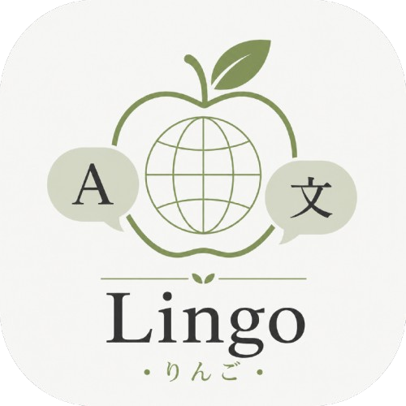

<div align="center">

    
<h1>Lingo Bot</h1>
  
<a href="https://go.dev/">
  
</a>
<a href="LICENSE">
  
</a>
</div>

---
**Lingo Bot** 是一款專為跨語言溝通與圖像文字數位化打造的智慧機器人。透過整合頂尖的翻譯引擎與 OCR 辨識技術，為使用者提供即時、精準的多語言解決方案。

---

## 核心功能

* **即時多語言翻譯**：支援多國語言即時轉換，透過 `$set` 指令即可輕鬆自訂翻譯目標。
* **圖像文字辨識 (OCR)**：支援圖片直接轉文字與翻譯，無需繁瑣手動輸入。
* **高併發處理**：專為群組環境設計，高效穩定地處理多人即時溝通需求。

---

##  快速上手

### 1. 語言設定
在群組或私訊中設定目標語言（範例為繁體中文、英文、日文）：
```text
$set zh-Hant en ja
```
### 2. 即時翻譯
設定完成後，發送訊息機器人將自動進行轉換。

### 3.圖片辨識與翻譯
直接上傳圖片，機器人將自動識別圖中內容並翻譯為目標語言。

## 聯繫作者
本專案由 カイ 維護。若有商業應用需求或產品反饋，歡迎提交 Issue 交流。

_Powered by Azure Cognitive Services & Azure Translate Services & LINE Messaging API_
